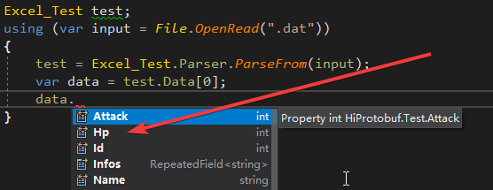

# HiExcel2Protobuf(Excel转Protobuf工具)

#### 功能说明
- 将Excel文件生成protobuf文件和protobuf数据
- 目前支持生成五种语言C++(生成.cpp),C#(生成.cs和.dll),Golang(生成.go),Java(生成.java),Python(生成.py)

#### 如何使用

从此处下载: [https://github.com/hiramtan/HiProtobuf/releases](https://github.com/hiramtan/HiProtobuf/releases)
1. 选择导出文件的存放目录
2. 选择Excel文件的存放目录
3. 选择编译器csc.exe
4. 点击导出

#### 类型对应关系

#### 详细说明
- 大多数Windows电脑上默认安装.Net Framework,编译器路径一般在C:\Windows\Microsoft.NET\Framework64.如果没有安装从此处下载安装 [https://dotnet.microsoft.com/download/dotnet-framework](https://dotnet.microsoft.com/download/dotnet-framework)
- 如果希望导出.go文件,需要额外做一些操作,具体参照官方介绍: [https://developers.google.cn/protocol-buffers/docs/gotutorial](https://developers.google.cn/protocol-buffers/docs/gotutorial)
- C#语言额外导出了一份.dll,可以使用.cs源码或者.dll文件
- 会递归遍历Excel目录下的所有文件
- 会在导出目录下自动生成三个目录:
  - proto 存放.proto原始文件
  - language 存放各语言的生成文件(比如language/cpp/xx.cpp)
  - dat 存放.dat protobuf序列化数据
- 支持的数据类型有: "double", "float", "int32", "int64", "uint32", "uint64", "sint32", "sint64", "fixed32", "fixed64","sfixed32", "sfixed64", "bool", "string", "bytes"
- 支持对应的数组类型,数据分割用|

  
- Excel配置格式如下:
  - 第一行为注释说明
  - 第二行为变量类型
  - 第三行为变量命名

  
- 运行时使用如下:

  
- 扩展:源码里面的对象很容易生成其他语言(Lua/Ruby/PHP...)和数据(Json/Xml/Bin...)

---------------------------------
Support: hiramtan@live.com
